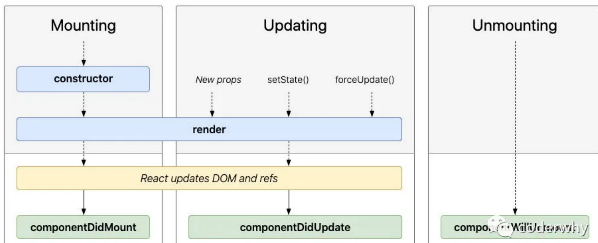
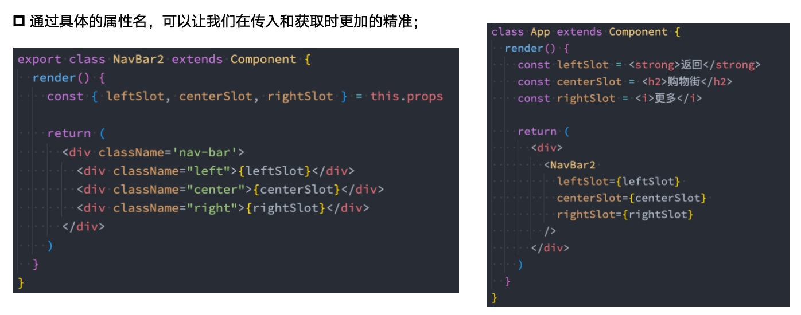

### 1.React的组件化
根据不同的方式可以分成很多类组件：最主要要记住的是函数组件和类组件，其他还有一些无状态组件和有状态组件，展示型组件和容器型组件等。

#### 类组件
类组件等要求：
  - 组件的名称是大写字符开头；
  - 需要继承自React.Component;
  - 需要有render函数

render函数的返回值：
- React元素；
- 数组或者fragments；
- Portals；
- 字符串或数值类型；
- 布尔类型或者null，undefined

#### 函数式组件
使用function来进行定义的函数，只是这个函数会返回和类组件中render函数返回一样的内容。
```jsx
  function App(){
    return <h1>hhhhh<h1/>
  }
```
特点：
- 没有生命周期，也会被更新并挂载，但是没有生命周期函数；
- this关键字不能指向组件实例（因为没有组件实例）；
- 没有内部状态（state）

### 2.React的生命周期

componentDidMount：会在组件挂载之后立即调用。在此处发送网络请求是最好的。

### 3.组件通信
父传子：父组件通过 属性=值 的形式来传递给子组件数据；子组件通过 props 参数获取父组件传递过来的数据；
```jsx
伪代码：
  父：<Banner banners={ banners } />
  子：
  class Banner extends Component {
    //这里的这个constructor和super如果子元素里面没有自己的state，这部分可以省略不写，因为默认就会进行这个操作
  constructor(props) {
    super(props)
   }

  render() {
    const { banners } = this.props
    return (
      <div>
        { banners }
      </div>
    )
  }
}
```
子传父：React中同样是通过props传递消息，只是让父组件给子组件传递一个回调函数，在子组件中调用这个函数即可。
```jsx
伪代码：
  父：<Banner changeCount={ (count)=>changeState(count) } />
  子：
  class Banner extends Component {

  addCount(count){
    this.props.changeCount(count)
  }

  render() {
    return (
      <div>
        <button onClick={e => addCount(1)}>+1</button>
      </div>
    )
  }
}
```

### 4.组件插槽
其实React中是没有插槽的，他就是依靠js来实现的。
有两种方案可以实现：
- 组件的children子元素；  
  每个组件都可以获取到 props.children：它包含组件的开始标签和结束标签之间的内容。
  ```jsx
  <NavBar >
    <button>button</button>
    <h2>h2</h2>
    <i>iii</i>
  </NavBar>
  class NavBar extends Component {
  render() {
    const { children } = this.props
    return (
      <div>
        <div className="lef">{ children[0] }</div>
        <div className="center">{ children[1] }</div>
        <div className="right">{ children[2] }</div>
      </div>
    )
  }
  }
  ```
::: tip 提示
  this.props.children当传递多个元素的时候，接收的是一个数字，但是只传递一个元素的时候，接收的就是一个值，（react内部源码是用arguments实现的），所以使用的时候需要注意，我们也可以用propTypes参数来限制传过来的是一个array还是一个element来实现参数限制
:::
- props属性传递React元素；


::: tip 提示
  有一个作用域插槽的概念，当我们父组件传递数据给自组件展示，但是又需要父组件指定自组件的展示方式，这时候展示的数据是自组件知道，他又需要传递给父组件，这时候我们可以直接让父组件传递一个函数，这样就能获得参数又能由父组件指定方式。
  示例：
  ```jsx
  父：
  class Main extends Component {
  constructor() {
    super()
    this.state = {
      navbar:[1,2,3]
    }
  }

  getItem(item) {
    return <button>{ item }</button>
  }

  render() {
    return (
      <div>
        <NavBar navbar={this.state.navbar} itemType={(item)=>this.getItem(item)}
        ></NavBar>
      </div>
    )
  }
}
  子：
  class NavBar extends Component {
  render() {
    const { navbar,itemType } = this.props
    return (
      <div>
        {navbar.map((item) =>
          itemType(item)
        )}
      </div>
    )
  }
}
  ```
::: 

### 5.组件通信之Context
==补充==：通信中有一个可以一层层传递的案例就是==Spread Attributes==，但使用的也不是特别多具体就是：
```jsx
  Home：
  info：{name:'aaa',age:18}
  <HomeHeader {...info：} />
  HomeHeader：
```
React提供了一个API：Context；Context 提供了一种在组件之间共享此类值的方式，而不必显式地通过组件树的逐层传递 props
我们要使用Context还是比较麻烦的：
```jsx
  1.创建一个需要共享的Context对象：
    const MyContext = React.createContext(默认值)
    export MyContext
  2.使用Provider，并且接收一个value属性传递给需要的组件：
    <MyContext.Provider value={color:'red'} />
  类组件：
  3.在需要数据的组件指定需要获取的上下文Context（因为可能有多个上下文）：
    import MyContext from ...
    MyClass.contextType = MyContext
  4.获取数据并且使用数据：
    this.context.color
  函数式组件：
    import MyContext from ...
    <MyContext.Consumer>
      {value => <h2>{value.color}<h2/>}
    <MyContext.Consumer />
```
::: tip 提示
什么时候需要ConText默认值：
```jsx
  <MyContext.Provider value={color:'red'} >
  <MyContext.Provider />
  <Home />
```
  这时候在Home里面如果想要MyClass.contextType = MyContext，这样获取的context里面的value就是设置的默认值，因为它不在共享区域内。
::: 

==补充==：还有一个非父子组件通信-EventBus，时间总线，vue里面也可以用，就不细说了。

### 6.setState

> 💬 **Q：为什么使用setState？**  
> 🧠 A：因为如果想要跟踪数据的变化，我们如果直接改变this.state的值，react没办法跟踪数据的变化，react没有像vue2中definedProperty和vue3中proxy中的数据劫持，所以必须通过setState来告知React数据已经发生了变化。==setState方法来自哪里==，就来自我们继承的Component里面的（在源码里面可以看到Component.prototype.setState = function...）。

setState的三种使用：
- 直接传入一个对象
```jsx
  this.setState({
    message:'aaa'
  })
```
::: tip 提示
  如果我们state中不止有message这个属性，还有counter等其他的属性，为什么我们直接赋值一个对象不会覆盖掉原本的state对象？==原因：==因为在react的内部源码中执行的是Object.assign的合并操作
::: 
- 传入一个回调函数
```jsx
  this.setState((state,props)=>{
    return{
      message:'xxx'
    }
  })
```
::: tip 提示
  这样做有两个好处：1.可以在函数里面执行一些操作，使这个组件更有内聚性；2.我们可以拿到原本的state的值和父组件传递过来的props值做一些操作。
::: 
- 传入一个对象和一个回调函数（setState的操作是异步的）
```jsx
  this.setState({message:'xxx'},()=>{
    console.log(this.state.message) ---新的值
  })
  console.log(this.state.message) --- 旧的值
```
::: tip 提示
  因为setState在React的时间处理中是一个异步调用，如果希望在数据更新之后立马拿到新的数据做一些操作，就可以在第二个参数callback中执行一些逻辑代码
::: 

> 💬 **Q：React中的setState是同步还是异步（高频面试！！！）？**  
> 🧠 A：异步。为什么setState要设计成异步的，redux的作者曾经在github上回答过。主要就是以下两点：1.setState设计为异步可以==显著的提高性能==。如果每次调用 setState都进行一次更新，那么意味着render函数会被频繁调用，界面重新渲染，这样效率是很低的。react内部其实是将要进行的改变放进了一个队列，然后在批量的进行处理，处理完了之后再马上调用render函数进行更新；2.==如果同步更新了state，但是还没有执行render函数，那么state和props不能保持同步==，因为render函数涉及到了DOM的更新操作等一些比较慢的操作，所以如果state改变了，但还没来得及执行render函数，会导致父组件中用到的state改变了，但是可能传递给自组件的props值还没来得及改变的问题，就会导致state和props不能保持一致性。