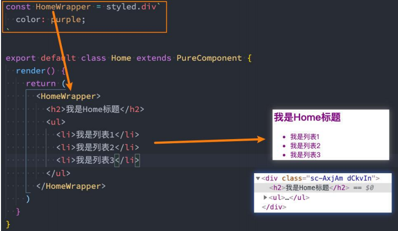

### styled-components
  有很多在react写css的方案，但是都有各自的缺点，有的会触发全局，有的有些伪类不生效等等。
所以最终的方案就是css in js。其中国内外用的最多的就是styled-componets

- 支持直接子代选择器或后代选择器，并且直接编写样式；
- 可以通过&符号获取当前元素；
- 直接伪类选择器、伪元素等；



### 可以传递props，attrs
这其实本身就是一个样式组件，所以我们可以传递props。获取props需要通过${}传入一个插值函数，props会作为该函数的参数

```jsx
<HYInput type="password" left="20px" />

const HYInput = styled.input.attrs({
  placeholder:"请填写密码",
  paddingLeft: props => props.left || "5px"
})`
  border-color:red;
  padding-left:${props => props.paddingLeft};

  &:focus:{
    outline-color:orange;
  }
`
```

### 高阶特性
- 继承
```jsx
  const MyButton = styled.button`xxx`

  const BasicButton = styled(MyButton)`xxx`
```
- 设置主题 Provider

### classnames库
可以让class的使用更加灵活
```jsx
import { classnames } from classnames

<div className={classnames('aaa',{bar:isBar})}></div>
```