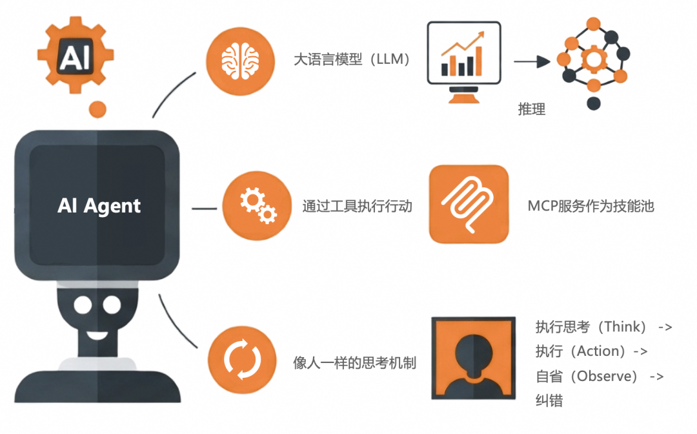

[参考文章：](https://mp.weixin.qq.com/s/lNiivIN3QyB6kr9zWr8VFA)

解决的痛点：
    客户希望自己的业务被AI赋能的诉求是强烈的，但是在构建企业级AI应用，或者使用AI赋能现有业务方面，大多数客户是不知道从哪里下手的，都是只有一些片面的知识点，尤其是对现存业务，Agent，LLM，MCP服务，AI可观测这几者之间如何有机协作是模糊的。

AI应用就是从“工具”到“智能伙伴”的进化，
对于我们传统的软件来说，都是处理特定任务的工具，遵循一套预设的固定的逻辑，然后被动的执行，而企业级的AI应用，它不再仅仅被动地“听令”，而是能够主动地“理解”、“思考”和“行动”。它更像是一个“智能伙伴”或“数字员工”，其核心价值——将人类从重复性、流程化的工作中解放出来，聚焦于更高层次的创造、决策和战略规划。

### 什么是AI Agent

一个AI Agent系统包含三个核心内容：
1. 使用大语言模型LLM来推理（大脑）；
2. 可以通过工具执行各类行动；
3. 可以通过工具执行各类行动。
执行思考（Think） -> 执行（Action）-> 自省（Observe） -> 纠错（既重复思考到自省的持续改进）这样一个循环