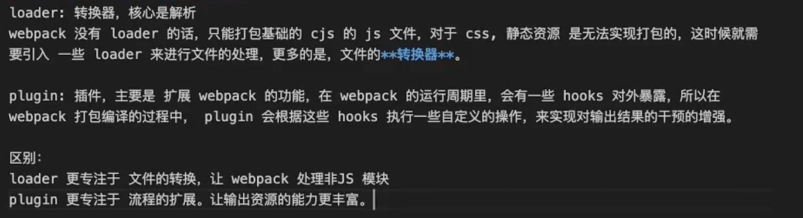

1. 事件addEventListener
  addEventListener和removeEventListener接收三个参数，要处理的事件名，事件处理函数，和一个布尔值（true: 在捕获阶段调用事件， false: 在冒泡阶段调用）

2.Promise.all和Promise.allSettled有什么区别？会用在什么场景？
  答：all是所有成功就返回成功的一个数组，遇到一个失败就直接返回第一个失败的失败原因。allSettled是无论成功失败都返回最终的执行结果的对象数组。  
  适用场景：all适合于提交表单，批量处理文件等；allSettled适合于批量发送通知等

3.函数柯里化
  答：函数柯里化（Currying）是一种将接收多个参数的函数转换为一系列只接收单一参数的函数的技术。简单说，就是把 f(a, b, c) 变成 f(a)(b)(c) 的形式。主要用于可以将一些固定函数无需传入

4.原型继承
  答：在JS中，每个对象都有一个隐藏的Prototype属性指向它的原型对象，可以通过__proto__访问。当我们访问一个对象的时候会先在对象自身查找，找到就使用，找不到就沿着Prototype指向的原型链查找，直到原型链的终点null

5.loader和plugin的区别？
