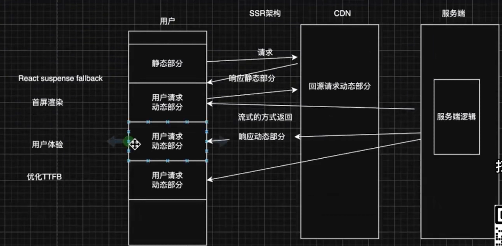

## 性能指标：
FCP：第一个元素被加载出来要多久  
LCP：耗时最久的元素加载出来要多久  
TTFB：从发出资源请求到第一个字节开始到达之间的时间（网络层面） 

## 工具：lighthouse，network，performance

## 网络层面的优化：
- 使用缓存
    浏览器缓存：判断是否有缓存，有缓存就判断是否过期

## DNS优化
- 减少DNS查询次数，提前解析关键域名，提升页面加载速度
- DNS 预取 DNS Prefetching
- <link rel="dns-preftch" href="xxxxx">
  避免过度与解析
- <link rel="preconnect" href="xxxxx"> 进一步建立连接 TLS握手

## 域名收敛
- 减少查询次数
- 利用 http2.0 多路复用特性 避免重复 TCP 握手

## CDN
静态资源存储在CDN

## SSR 网络 + 渲染

## 渲染层面
- 尽可能减少资源个数
- 尽可能减少资源体积大小

## 减少文件大小
- 压缩 html 减少 html体积
- CSS 按需引入css原子能力
- JS 构建工具按需引入

## 图片加载
