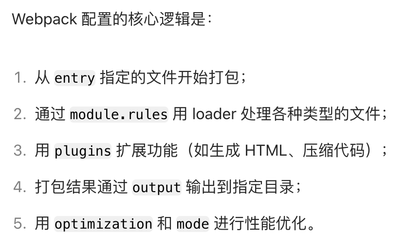

1. memo和useMemo？
  答：memo用于缓存组件，避免无效重渲染。组件被 memo 包装后，React 会在重渲染前浅比较新旧 props，如果不变，复用上次的渲染结果，不重新执行。除了接收第一个参数组件之外，还接受第二个参数自定义比较函数。  useMemo，缓存值，避免重复计算。当依赖项未变化时，复用上次的计算结果。useMemo 接收两个参数：① 计算函数（返回需要缓存的值）；② 依赖项数组。useMemo也是浅比较依赖项。
2. webpack的配置项？
  答：主要分为：入口（entry），输出（output）：里面可以配置path，filename等等，模块处理（module），核心是rules规则，test匹配文件，use指定加载器loader。
  ```jsx 
  rules: [
      {
        test: /\.css$/i,
        use: [
          'style-loader'
        ]
      }]
  ```
  插件（plugins），模式（mode）：指定打包模式，开发模式，生产模式，优化（optimization）：代码分割，压缩，Tree-shaking，还有其他的resolve，devServer等维度。
  
3. vue和react的区别是什么？
4. 说说redux？
5. vue2和vue3的区别？
6. react中的事件机制？
  答：合成事件，通过 JSX 属性（如 onClick）绑定。
7. 怎么改变两个宏任务的执行顺序？
8. ts的数据类型
9. 深拷贝的方法？
10. 